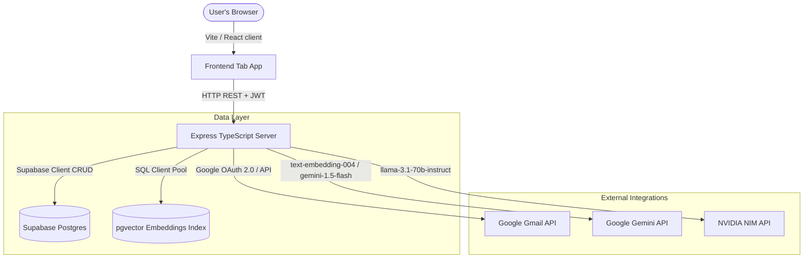
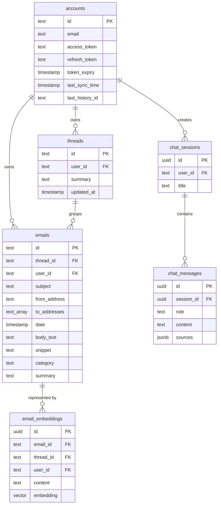

# Gmail Intelligence Platform — Architecture & Design Document

This document outlines the system architecture, database design, AI engineering decisions, Gmail integration strategies, and technical trade-offs for the **AI-powered Gmail Intelligence Platform**.

---

## 1. System Architecture

The application is architected as a decoupled client-server full-stack web system with external integrations for email and AI pipelines.

### Components Interaction Flow
1. **Frontend App (Port 3000):** Built on Vite, React, and TypeScript. Styled with high-end dark mode Vanilla CSS, featuring visual overview tiles, a dual-pane responsive inbox, RAG chat dialogues, and deduplicated news feeds.
2. **Backend Server (Port 3001):** Built on Node.js, Express, and TypeScript. Exposes security controllers (JWT, CORS, Google OAuth redirect callback), handles bulk MIME ingestion and synchronization queues, and drives RAG completion agents.
3. **Database (Supabase + pgvector):** Manages relations for credentials, threads, messages, and vector embeddings. It uses the `pg` pool to execute direct Postgres functions like cosine vector proximity checks.
4. **Gmail API Integration:** Exchanges credentials, fetches paginated threads, and reconstructs reply headers to preserve threading directly in Gmail.
5. **Double LLM Layer:**
   - **Google Gemini API (Primary Model):** Handles document summaries (individual emails & threads), creates 768-dimensional text embeddings, and performs interactive conversational RAG reasoning.
   - **NVIDIA NIM (Secondary Model):** Uses `meta/llama-3.1-70b-instruct` to run high-speed email classifications and perform semantic newsletter deduplication.

---

## 2. Database Schema

We use PostgreSQL hosted on Supabase, structured as follows:

### Data Modeling & pgvector Decisions
- **`pgvector` Embedding Dimension:** We configure the `embedding` column on `email_embeddings` as a `vector(768)` matching Google's `text-embedding-004` dimensions.
- **Indices:** High-performance B-Tree indices are created on foreign keys (`thread_id`, `user_id`), dates (`date` desc), and classification columns (`category`) to accelerate inbox filtering.
- **Cosine Proximity Search (`match_emails`):** A custom PL/pgSQL function runs on Postgres:
  $$1 - (\text{embedding} \Leftrightarrow \text{query\_embedding})$$
  This computes cosine similarities directly on the database server, filtered by the active `user_id` and optional category boundaries.

---

## 3. AI Design

### Email Summarization Strategy
- **Individual Summary:** The server extracts the sender, subject, and body snippet (first 3000 chars), prompts `gemini-1.5-flash` to construct a concise 2-sentence summary detailing the origin, topic, and necessary action.
- **Thread Summary:** When syncing a thread, all messages are sorted chronologically, compiled into a single text stack (message number, date, sender, and content snippet), and analyzed by Gemini. This captures the conversation arc, decision shifts, and outstanding tasks.

### RAG Pipeline & Retrieval
1. **Embedding generation:** The user query is converted into a 768-dimensional vector via `text-embedding-004`.
2. **Proximity matching:** The database searches for the top 6 most semantically similar email contents matching the user's account.
3. **Synthesis & Strict Grounding:** The matched context (sender, date, subject, and snippets) is structured into a unified context block. Gemini receives a strict instruction set:
   - Reject queries if details aren't present in the context ("*I couldn't find any information about that in your synced email history*").
   - Explicitly cite source numbers (e.g. `[Source #1]`) matching statements to avoid hallucination.
   - Return unique email metadata mapping (message ID, thread ID, sender, subject) in a separate `sources` JSON field to enable frontend popup inspection.

### NVIDIA NIM Model Selection
- We selected **`meta/llama-3.1-70b-instruct`** from NVIDIA NIM. 
- **Role:** Llama-3.1 70B is an exceptional instruction-following model. We leverage it to categorize incoming emails (extracting strict category terms with zero explanations) and to semantically group overlapping news stories across newsletters (outputting raw JSON matching titles and summaries).

---

## 4. Gmail API Strategy

### Initial vs. Incremental Sync
- **Initial Sync:** Fetches a configurable limit of the user's latest threads (default: 30) using `threads.list`. It maps, parses, categorizes, summarizes, embeds, and indexes them in a background process using `p-limit` to restrict concurrency.
- **Incremental Sync:** Checks the user's `last_sync_time`. When triggered, it requests threads matching `after:epoch_seconds` (offset by 2 days for timezone safety). It processes new or updated items, ignoring existing emails to minimize API load.

### Rate Limiting and Pagination
- **Pagination:** Handles pagination loops using Gmail's `nextPageToken` during list operations.
- **Exponential Backoff:** A wrapper function `executeWithRetry` intercepts all Gmail API calls. If a status code `429 (Too Many Requests)` or `503 (Service Unavailable)` is returned, it pauses execution and retries with a doubling delay.

---

## 5. Tool & Technology Decisions

- **Vite + React (Frontend):** Selected for rapid hot-reloads, TypeScript safety, and quick bundle sizes.
- **Node + Express (Backend):** JavaScript consistency across the stack; native async-await supports high-concurrency sync loops.
- **Vanilla CSS:** Replaces Tailwind to avoid version locking issues, implementing modern flexbox/grid layout and dark styling tokens manually.
- **pg Pool connection:** Bypasses Supabase API wrappers for raw `pgvector` operators, allowing fast binary vector operations.

---

## 6. Trade-offs & Limitations

- **MIME Body Limits:** To avoid database overflow and API token exhaust, we slice email plain text inputs to the first 3000 characters before summarizing or embedding.
- **Offline Sandbox seeding:** Since evaluation environments might lack Google Client API credentials, we built a local demo seeder. Clicking the mock option populates the database with realistic tech syncs, rejections, invoices, and newsletter stories to demonstrate full RAG functionality.
